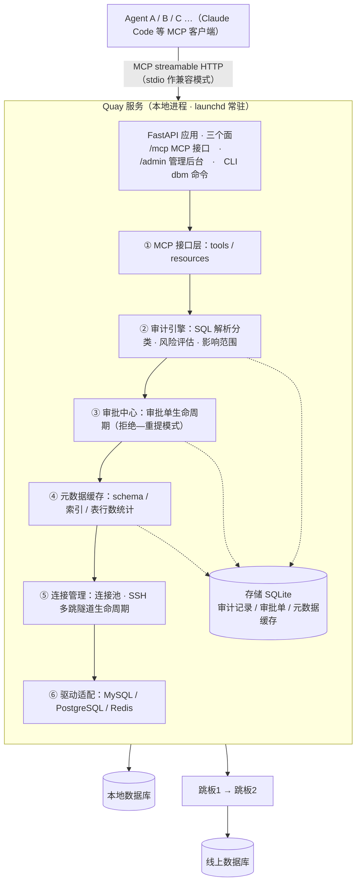
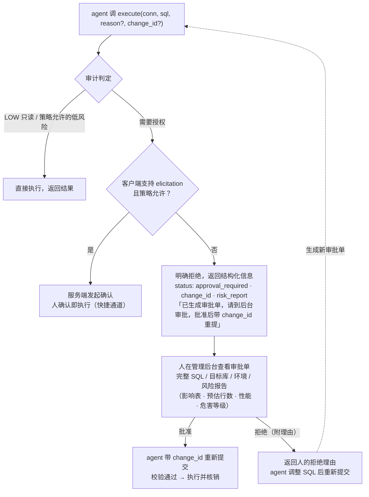

# Quay 设计文档

> 状态：已确认技术选型（Python + FastMCP / MySQL + PG + Redis / elicitation + CLI 审批，Web 后台 / 本地进程 + launchd 常驻部署）

## 一、目标

以 MCP 服务形式为所有 agent 提供数据库访问能力：

- 按**项目**管理多个数据库连接与账密
- 支持本地和线上库，线上库支持**多层 SSH 跳板**
- **SQL 审计**：判断安全性与影响范围，配合权限控制
- **操作记录**：哪个 agent、什么时间、在哪个库、跑了什么 SQL、结果概况（行数、耗时）
- **人工授权**：数据变更操作必须经人明确授权后才能执行
- **管理后台**：查看审计数据、处理审批单

## 二、总体架构



## 三、技术选型

| 组件 | 选择 | 说明 |
|---|---|---|
| 语言/框架 | Python 3.12 + FastMCP（官方 MCP SDK）+ FastAPI | MCP 与管理后台共用一个 ASGI 应用 |
| SQL 解析 | **sqlglot** | AST 级解析：语句分类、提取涉及表/列、识别多语句与 CTE 内写操作 |
| SQL 审计 | sqlglot 规则引擎 + `EXPLAIN` + information_schema 统计（自建核心）；**goInception** 作为可选增强（Docker sidecar，仅 MySQL，提供成熟的审核规则与影响行数估算） | 说明：Python 生态中"解析"有成熟库（sqlglot），"安全审计"没有开箱即用的成熟库，业界通行做法即 AST 规则 + EXPLAIN；goInception 是独立服务形态的成熟审计组件 |
| 多数据库 | SQLAlchemy Core（不用 ORM）+ redis-py | 统一 MySQL/PG 方言；Redis 走命令分类模型 |
| SSH 多跳 | 子进程调用系统 OpenSSH：`ssh -N -L 本地端口:db:port -J jump1,jump2 target` | 天然多跳、复用 `~/.ssh/config`；本地进程直接读 `~/.ssh` 与真实 key 路径 |
| 密钥 | SecretProvider 抽象：`env://`（Docker 推荐，经 docker secret/env 注入）、`file+age`（加密配置文件）、`keyring://`（裸机运行时用 macOS Keychain） | **Docker 内无法访问宿主 Keychain**，故容器部署默认 env/加密文件 |
| 存储 | SQLite（volume 持久化） | 审计、审批单、元数据缓存 |
| 管理后台 | FastMCP custom_route（Starlette）+ 服务端渲染 HTML | 与 MCP 同进程；实现时未引入 Jinja2/HTMX，用无外部依赖的 f-string 渲染（YAGNI，规避 CSP/静态资源），够用即可 |

## 四、配置模型

```yaml
projects:
  shop-backend:
    connections:
      prod-mysql:
        engine: mysql            # mysql / postgres / redis
        host: 10.0.3.12
        port: 3306
        database: shop
        environment: prod        # local / dev / staging / prod
        user: shop_reader
        password: env://SHOP_PROD_READER_PW    # 或 keyring:// / agefile://
        writer:                  # 可选：审批通过后才使用的提权账号
          user: shop_writer
          password: env://SHOP_PROD_WRITER_PW
        jump_hosts: [bastion1.corp, bastion2.corp]   # 多层跳板，按序
        policy:
          auto_approve_low_risk_write: false  # dev 环境可放宽
          max_rows: 1000
          statement_timeout_s: 30
```

连接与密钥的增删改**只走 CLI 由人操作**（`dbm conn add` 交互式录入），不暴露给 agent。

## 五、审计引擎

对每条提交的 SQL 产出一份**风险报告**（同时用于自动放行判断和人工审批参考）：

1. **语句分类**（sqlglot AST）：只读白名单 SELECT / SHOW / DESCRIBE / EXPLAIN；其余（DML / DDL / 存储过程 / 多语句 / **解析失败**）一律按写操作处理——默认拒绝原则。
2. **影响范围**：涉及的库/表/列（sqlglot 提取）+ 表行数量级（元数据缓存）+ `EXPLAIN` 预估扫描/影响行数、是否命中索引。
3. **风险规则**（可配置）：
   - CRITICAL：DROP / TRUNCATE / 无 WHERE 的 UPDATE/DELETE / Redis FLUSHDB/FLUSHALL
   - HIGH：大表 DDL（提示锁表风险）、预估影响行数超阈值、全表扫描写
   - MEDIUM：普通带索引条件的小范围写
   - LOW：只读
4. **元数据缓存**：定期/按需从 information_schema、pg_catalog 拉取 schema、索引、表行数，构成对目标库的"认知"，供 EXPLAIN 结果解读和审批展示。
5. **Redis 命令分类**：读命令（GET/MGET/HGETALL/SCAN…）直通；单 key 写（SET/DEL/EXPIRE…）按 MEDIUM；KEYS / FLUSHDB / FLUSHALL / CONFIG 按 CRITICAL 需审批。

## 六、授权流程（拒绝—重提 + change_id 放行）

> 设计决策：交互形态采用"拒绝—重提"（单一 `execute` 入口，agent 无需理解审批协议）；
> 放行凭据采用 **change_id**（确定性，不依赖 agent 重提一字不差的 SQL）；
> SQL 指纹只用于校验与无 id 时的兜底匹配。



规则：

- **执行的永远是审批单里存储的 SQL**。agent 重提的文本只用于校验：规范化指纹与审批单不一致 → 拒绝并说明"与已批准的 SQL 不一致"。保证"人批的"和"实际执行的"是同一条语句，杜绝批准后偷换内容（无论 agent 有意还是无意改写）。
- 放行匹配优先凭 `change_id`；重提未带 id 时，退回 **SQL 规范化指纹 + connection** 兜底匹配。
- 审批单**一次性**核销；TTL 默认 30 分钟，过期作废。
- `prod` 环境强制走审批（elicitation 快捷通道是否对 prod 开放，策略可配，默认关闭）。
- 写操作执行时切换 **writer 账号**；日常查询始终走只读账号（数据库层第二道防线）。
- 通知遵循"安静即正常"：不主动推送任何通知，审批挂起由 agent 在会话中告知用户。

## 七、操作记录（审计日志）

每次工具调用记录到 SQLite：

| 字段 | 说明 |
|---|---|
| agent | MCP clientInfo（名称/版本）+ session id |
| time | 提交时间 / 执行时间 |
| connection | 项目 / 连接名 / 环境 |
| sql | 原文 + 规范化指纹 |
| risk | 风险等级 + 报告摘要 |
| result | 状态（成功/失败/被拒/待审批）、返回/影响行数、耗时 |
| approval | 关联审批单号、审批人、审批时间（写操作） |

密码等敏感信息永不出现在记录、日志与工具返回值中。

## 八、管理后台（/admin）

- **审计记录**：按项目/连接/agent/时间/风险等级筛选查询操作历史
- **审批中心**：待审列表 → 详情页（SQL、风险报告、EXPLAIN、影响范围）→ 批准/拒绝（附理由）
- **连接总览**：连接健康状态、隧道状态（只读展示，不提供改密钥入口）
- 本地部署，默认只监听 127.0.0.1；后续可加简单登录

## 九、MCP 工具集

| 工具 | 说明 |
|---|---|
| `list_projects` / `list_connections` | 浏览可用连接（不含密钥） |
| `query(project, connection, sql)` | 强制只读：非只读语句直接报错，不进审批 |
| `execute(project, connection, sql, reason?, change_id?)` | 统一入口，走完整审计+授权流程；批准后带 change_id 重提放行（见第六节） |
| `get_change_status(change_id)` | 查询审批单状态 |
| `list_tables` / `describe_table` / `sample_rows` | schema 探索 |
（Redis **不暴露为 MCP 工具**，仅供人通过 /admin/redis 管理后台操作）|
| `test_connection(project, connection)` | 连通性检查（含隧道建立） |
| `analysis_workspaces` / `analysis_import` / `analysis_sql` / `run_workflow` | 分析工作台（见第十二节与 ANALYSIS.md） |

resources：`dbm://projects/...` 暴露连接元数据（不含密钥）。

## 十、部署

**本地进程模式**（不用 Docker——本地单机场景 Docker 只带麻烦：连宿主库绕网络、容器内无 keyring 后端使连接管理页残废、SSH key 变容器内路径）。

- 前台：`uv run dbm serve`，监听 127.0.0.1:8100（MCP + admin 同端口）
- macOS 常驻：`scripts/install-launchd.sh` 装为 launchd LaunchAgent，开机自启 + 崩溃自动拉起（约 10s 重启节流）
- 密钥：`~/.config/db-manage-mcp/env`（600）注入 `env://` 引用值 + `DBM_ADMIN_TOKEN`；页面新建连接的密码进系统 keyring
- SSH：直接读 `~/.ssh` 与真实 key 路径（本地进程,无容器路径映射问题）
- stdio 模式：`uv run dbm serve --stdio`，供单 agent 直连

## 十一、相关工作与现成工具对比（调研于 2026-07）

结论：**没有单一现成工具能覆盖本项目的需求组合**——"数据库 MCP 访问"已是红海，但"MCP + 审批工单 + 审计后台"的组合目前是空白。本项目的差异化在 M3（审计引擎 + 拒绝—重提审批 + 管理后台）。

| 需求 | DBHub (bytebase) | MCP Toolbox (Google) | Archery |
|---|---|---|---|
| MCP 接口 | ✅ | ✅ | ❌ |
| 多项目连接/账密管理 | 部分 | ✅（Secret Manager） | ✅ |
| SSH 多层跳板 | 单跳✅ 多跳❓ | ❌ | ❌ |
| SQL 审计（风险/影响范围） | ❌ | ❌ | ✅（goInception） |
| 写操作人工授权闭环 | ❌（只读一刀切） | ❌ | ✅ 但 agent 接不进 |
| 操作审计 + 管理后台 | ❌ | 部分（OTel） | ✅ |
| Redis | ❌ | ❌ | ✅ |

- **DBHub**（bytebase/dbhub）：通用数据库 MCP server，只读模式、行数限制、超时、SSH tunnel（读 `~/.ssh/config`）。相当于本项目 M1 + 半个 M2 的现成品，可作为**只读场景的短期应急方案**；其安全模型是"只读一刀切"而非"写走人工授权"。
- **MCP Toolbox for Databases**（googleapis/mcp-toolbox）：企业级连接池/OAuth2/OTel，理念是"预定义参数化工具"而非自由 SQL + 审计放行，偏 GCP 生态，无审批流。
- **Archery + goInception**：成熟的 SQL 审核查询平台（工单审批、查询授权、高危驳回、审计、Web 页面，支持 MySQL/PG/Redis 等），但没有 MCP 接口，agent 无法闭环。**作为本项目审批流与管理后台的设计参考**；goInception 可作为 MySQL 审计规则的可选增强（见第五节）。

## 十二、里程碑

1. **[已完成] M1 骨架**：FastMCP daemon（Docker）+ 配置模型 + SecretProvider + MySQL/PG/SQLite 只读 `query` + schema 工具 + 操作记录落 SQLite
2. **[已完成] M2 连接**：SSH 多跳隧道（系统 OpenSSH，隧道随引擎池托管、空闲回收）+ 连接池 + 元数据缓存（schema/索引/行数，TTL）
3. **[已完成] M3 管控**：审计引擎（sqlglot + 元数据风险报告）+ 拒绝—重提审批流（change_id 放行、writer 双账号）+ 管理后台（审计查看 + 审批中心）
4. **[已完成] M4 增强**：elicitation 快捷审批（local/dev 默认开、prod 默认关，审批单始终留痕）+ Redis 适配（命令分类 + 同一套审批流）+ 敏感字段脱敏（内置模式 + mask_columns）+ CLI 审批兜底（dbm approvals/approve/reject）
5. **待定** goInception 可选集成：需实例联调，接入点预留在 audit/risk.py

## 十三、后续演进（已实现功能补充）

本设计文档撰写于项目早期（M1~M4 阶段）。随后实现的功能如下（详见 ANALYSIS.md 与 USER_GUIDE.md）：

**查询台**（`/admin/sql`）：
- **深色 IDE**：Vue 3 + Monaco 编辑器，库→表→列三级对象树（表容量展示、拖拽分隔条、库多时 schema 过滤）
- **执行与导航**：光标处执行、多语句语境分离、上下文感知补全（FROM 后补表、SELECT/WHERE 补列、别名补字段）
- **结果可视化**：分页+LIMIT 兜底（防大表拉挂）、表格/图表切换（ECharts：柱/折线/饼/散点 + X/Y/聚合）、CSV/JSON/Markdown/XLSX 导出
- **表数据页**：双击表打开数据网格；WHERE/ORDER BY 走 SQL 重查（跨页正确、输入弹字段提示）；列显示类型（数值列可按时间戳展示，仅展示不写库）；时间列日期选择器
- **暂存式编辑**：改单元格/加行/减行都先攒着标记，数据工具栏「提交（N）」统一写库（SQL 确认 / 直接提交两种）；writer 执行并审计，管理员旁路不进审批流
- **结果与列**：查询结果 tab（每执行新增、hover 显 SQL）；表头列类型图标；Value/Record 类型感知面板（查询结果只读支持）；表格/图表切换、CSV/JSON/Markdown/XLSX 导出
- **编辑器工具**：右键格式化/EXPLAIN/EXPLAIN ANALYZE；MySQL 函数 hover 文档（179 条）；光标处执行、上下文补全、EXPLAIN 计划树、历史、片段库、执行 schema
- **多 tab + 防混淆**：tab 连接+环境徽章（prod 红/dev 蓝）杜绝本地线上混淆、切连接清残留；四类 tab 可拖拽/pin；全状态有界持久保活（只存当前结果、超限降级），服务端异步执行不中断

**分析工作台**（DuckDB 本地沙箱）：
- **跨源数据导入**：右键表「导入到分析工作区」或 MCP `analysis_import` 工具（reader 拉取、审计、行数上限 20 万/硬上限 50 万）
- **自由分析**：工作区内任意 SQL（JOIN/聚合/建 VIEW/建表）不需审批，计算下推模式
- **工作流沉淀**：脚本式（多语句 SQL）与可视化 DAG（取数/文件/过滤/JOIN/聚合/SQL/输出七类节点）
- **一键重跑**：MCP `run_workflow` 工具支持，自动重拉源数据→按序执行→返回逐步状态
- **内置示例**：首次启动播种「示例 · 渠道ROI分析」，展示全部 DAG 节点类型与流程
- **结果可视化**：输出结果区支持图表配置（配置随 workflow 保存、重跑自动出图）


详细设计见 **[ANALYSIS.md](ANALYSIS.md) 分析工作台** 和 **[USER_GUIDE.md](USER_GUIDE.md) 用户手册**。

## 十四、待办 / 未做（有意推迟）

### Redis Cluster（集群）支持 — 待有真实集群环境再做

当前 Redis 实现只覆盖**单机 / 主从 / 哨兵**（`redis.Redis(host, port, db=...)`）。集群模式与现有实现有**结构性冲突**，不是改连接串就行，故推迟到有真实集群 e2e 环境后再做（红线：不写无法验证的集成代码）。

集群 vs 单机的关键差异与适配点：

| 差异 | 影响的现有代码 | 适配方向 |
|---|---|---|
| **无多逻辑库**（只有 db0，`SELECT` 报错） | `keyspace_dbs`（库树第一层）、池 key 的 `db` 维度、前端库切换器 | 集群模式隐藏「库」层；池 key 去掉 db 维度 |
| **数据分 16384 slot 到多 master** | `scan_keys` 单连接 SCAN 只扫到本节点、漏分片 | 改用 `RedisCluster.scan_iter`（内部 fan-out 各 master） |
| **客户端不同** | `_build_client` 用 `redis.Redis` | 探测 `INFO` 的 `cluster_enabled:1` 或配置 `cluster:true`，分叉走 `redis.cluster.RedisCluster` |
| **多 key 须同 slot**（否则 `CROSSSLOT`） | 右键「删除目录下所有键」拼一条 `DEL k1 k2 …` | 集群模式逐 key 发 DEL，不拼批量 |
| **INFO keyspace / DBSIZE 每节点各报各的** | `keyspace_dbs` 键数统计 | 汇总各 master |
| **MOVED/ASK 重定向给内网 IP** | SSH 隧道只开一个端口够不着其他节点 | 每节点一条隧道，或用 `RedisCluster` 的 `address_remap` 映射到本地隧道端口（SSH+集群是最麻烦组合） |

**最小可行闭环**（真做时的第一步）：只支持集群的**键浏览 + 单 key 读写 + 命令窗口**（`RedisCluster` 对单 key 操作几乎透明），**明确不支持**跨 slot 批量与多库切换；前端对集群连接隐藏库切换器。配套用容器起 3 主 3 从 e2e 脚本（参照 `scripts/e2e_ssh_multihop.sh`）验证后再合入。

### goInception 深度审核集成 — 需跑起实例才能联调（接入点预留在 `audit/risk.py`）
