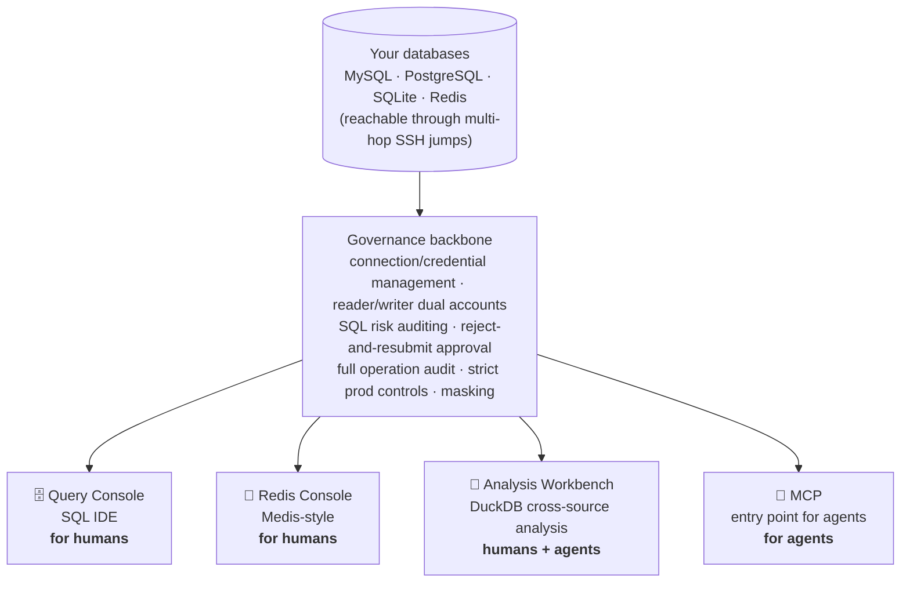

**English** | [简体中文](README.md)

# Quay

**A local database workbench — one entry point that lets both humans and AI agents use all your databases safely.**

Your database connections "dock" here (Quay = a wharf): MySQL / PostgreSQL / SQLite / Redis,
plus direct access to internal-network databases through multi-hop SSH jumps. It gives you unified
connection and credential management, SQL risk auditing with human authorization, and a full audit
trail of every operation. On top of that sit four ready-to-use frontends —
**Query Console · Redis Console · Analysis Workbench · MCP (the entry point for agents)** —
all sharing the same connections and the same governance backbone.

> The brand name is **Quay**. Internally the package is still `dbmcp` and the CLI is still `dbm`
> (the rename is cosmetic only and does not touch technical identifiers).
> MCP is just one of several entry points — this is not "an MCP server," but a governed database workbench.

## Four frontends, one governance backbone



- 🗄️ **Query Console** (`/admin/sql`): a DataGrip-style dark SQL IDE. Database → table → column tree,
  multiple tabs, context-aware completion, run-at-cursor, pagination, in-place cell editing, charts,
  EXPLAIN plan trees, export, and a snippet library.
- 🧊 **Redis Console** (`/admin/redis`): a Medis-style tool. Database → key-prefix tree, type badges,
  key detail views, a command window (reads pass through / writes require confirmation), and a
  command reference panel.
- 🔬 **Analysis Workbench**: snapshot data from different databases and files into a local DuckDB
  sandbox to JOIN and analyze freely, orchestrate workflows as visual DAGs, and let both humans and
  agents re-run them with a single click.
- 🤖 **MCP**: a controlled channel for agents. Reads pass through; writes go through
  "reject-and-resubmit + human authorization," with everything audited.

## Screenshots

**Query Console** (DataGrip-style dark SQL IDE): database → table → column tree, multiple tabs,
run-at-cursor, pagination, a result grid, and a chart toggle.


One click flips the result into a **chart** — bar / line / pie / scatter with X/Y/aggregation,
persisted per tab and saveable into a workflow:


## Documentation map

| Who you are | What to read |
|---|---|
| **Someone using the admin backend** | [USER_GUIDE.md](USER_GUIDE.md) (Chinese) — operating manual for the Query Console / Redis Console / Analysis Workbench / DAG canvas / approvals |
| **An AI agent being integrated** (or someone writing agent prompts) | [AGENT_GUIDE.md](AGENT_GUIDE.md) (Chinese) — tool map, approval-flow patterns, cross-source analysis and workflow usage |
| **A developer** | [DESIGN.md](DESIGN.md) (Chinese) architecture & security design · [ANALYSIS.md](ANALYSIS.md) (Chinese) Analysis Workbench design · CLAUDE.md dev conventions & lessons learned |

## Quick start

```bash
uv sync --extra keyring
cp config/connections.example.yaml config/connections.yaml   # edit as needed

# Run in the foreground (development / debugging)
DBM_MYSQL_PW=... DBM_ADMIN_TOKEN=your-token uv run dbm serve
# stdio mode (single-agent direct connection)
uv run dbm serve --stdio
```

Admin backend at `http://127.0.0.1:8100/admin/login`, MCP endpoint at `http://127.0.0.1:8100/mcp`.

Register the MCP server with Claude Code:

```bash
claude mcp add --transport http dbm http://127.0.0.1:8100/mcp
```

### Run as a service (macOS launchd — start on login, auto-restart on crash)

```bash
bash scripts/install-launchd.sh          # install and start; generates an admin token on first run
# Secrets live in ~/.config/db-manage-mcp/env (mode 600); add DBM_MYSQL_PW=... as needed
bash scripts/install-launchd.sh          # re-run after changing config/secrets to hot-reload (idempotent)
bash scripts/install-launchd.sh --uninstall
tail -f ~/Library/Logs/db-manage-mcp.log
```

### Double-click launch (generate a macOS .app)

If you'd rather not remember command lines, generate a double-clickable **Quay.app**: double-clicking
ensures the service is running (starts it via launchd if installed, otherwise launches it in the
background directly), then opens the admin backend in your default browser once the port is ready.

```bash
bash scripts/build-app.sh                 # generates ./Quay.app
bash scripts/build-app.sh ~/Applications  # put it in Launchpad/Spotlight (recommended)
```

A locally built app carries no quarantine flag, so double-clicking doesn't trigger Gatekeeper (no
signing/notarization required). The icon is bundled (`scripts/app-icon.png` — swap it and rebuild to
use your own). **Rebuild if you move the whole repo** (PROJECT_DIR is baked in at build time).

## MCP tools (for agents)

| Tool | Description |
|---|---|
| `list_projects` / `list_connections` | Browse available connections (no credentials; Redis is intentionally hidden) |
| `query(project, connection, sql)` | Read-only SQL; non-read statements are always rejected and audited; a fallback LIMIT is auto-injected when missing |
| `execute(project, connection, sql, reason?, change_id?)` | Writes: the first submission creates an approval request and returns a `change_id`; once approved, resubmit with the `change_id` to execute |
| `get_change_status(change_id)` | Approval-request status and risk report |
| `list_tables` / `describe_table` / `sample_rows` | Schema exploration |
| `test_connection` | Connectivity check |
| `analysis_workspaces` | List analysis workspaces, datasets, and saved workflows |
| `analysis_import(workspace, dataset, project, connection, sql, limit?, schema?)` | Snapshot a query result from a connection into a workspace (fetched by the reader, row-capped, audited) |
| `analysis_sql(workspace, sql, max_rows?)` | Run SQL in a workspace (DuckDB dialect, free JOIN/aggregation, no approval required) |
| `save_workflow(name, workspace, script)` | Persist an analysis script as a re-runnable workflow (its data-fetch recipe is saved automatically; cannot overwrite a human-drawn DAG) |
| `run_workflow(name)` | Re-run a saved analysis workflow with one call (script-based or DAG canvas) |

> **Redis is intentionally not exposed to agents** — only humans can operate it through the Redis Console in the backend.

## Query Console (/admin/sql)

A DataGrip-style dark SQL IDE that handles the everyday "connect → browse → query → export" loop on a single screen:

- **Object tree**: database → tables(N) → table → columns/keys/indexes, with table sizes shown in
  tiered M/G/T units; ⌘-select multiple tables → right-click to batch DROP (red confirmation bar,
  double confirmation for irreversible operations).
- **Editor**: Monaco (the VS Code core), with context-aware completion (tables after `FROM`; columns
  of the current statement's tables at `SELECT`/`WHERE`; tables after `database.`; columns after
  `alias.`), run-at-cursor for multi-statement scripts, sqlglot formatting, and a visual EXPLAIN
  plan tree.
- **Table data view**: double-click a table to open it; the WHERE / ORDER BY input bars re-run the
  query as SQL (correct across pages); click column headers to sort; double-click a cell for in-place
  editing; row-level insert/delete/clone (generating INSERT/DELETE through the write-confirmation
  flow); CSV/paste import (paste an Excel range directly — parameterized, single transaction); copy
  selected rows as TSV/INSERT/Markdown; ⌘F in-grid search; ⌘P cross-database table jump; and live
  SQL syntax highlighting of errors.
- **Result visualization**: toggle the result area between "Table / Chart" (ECharts) — bar/line/pie/
  scatter plus X/Y column and aggregation (SUM/COUNT/AVG/…) configuration; chart settings are saved
  with the workflow and re-rendered on re-run.
- **Multiple tabs**: three types — query / table data / DDL — draggable to reorder and pinnable;
  all state (including result sets) is persisted, so reopening the page restores everything as it
  was; **queries run asynchronously on the server and are not interrupted by navigating away**, and
  resuming reconnects to the results automatically.
- **Write safety**: a write statement first pops a risk report (affected tables/rows/indexes/execution
  plan); only after confirmation is it executed by the writer account, fully audited — this is a
  backend bypass; an agent's writes must still go through the approval flow.

## Redis Console (/admin/redis)

A standalone page modeled on Medis (the key-value model differs enough from SQL that it isn't mixed into the Query Console):

- **Left pane**: databases (all logical databases listed, non-empty ones with a key count; instances
  with very many databases get a cap to avoid flooding) → keys (`:`-prefix tree + colored
  STRING/HASH/LIST/SET/ZSET badges; clicking a folder expands one chain depth-first).
- **Key detail**: type-aware display + TTL / memory / encoding; msgpack values are auto-decoded to JSON.
- **Command window**: Monaco, execute the cursor/selected line; reads pass through, writes take a
  confirmation bypass; **write commands in prod require typing the connection name to confirm**;
  passwords and credential hashes in `CONFIG GET`/`ACL` results are auto-masked.
- **Command reference panel**: follows the command at the cursor, links out to redis.io, and covers
  176 common commands.

## Analysis Workbench

Snapshot data from different databases, different tables, and local CSV/Parquet files into a local
DuckDB sandbox to JOIN / aggregate / build virtual tables freely. Agents can use it through MCP too —
turning cross-source analysis from "impossible" for an agent into "one sentence."

**Visual DAG orchestration**: in the Query Console, click "＋Flow," drag nodes
(fetch / file / filter / JOIN / aggregate / SQL / output) and wire them into a dataflow diagram, then
run it with one click and see each node marked with its status. The graph is saved with the workflow,
and both humans and agents can re-run it in one click. You can build cross-source analysis flows
without writing SQL. See **[ANALYSIS.md](ANALYSIS.md)** (Chinese).

## Write authorization flow

1. An agent calls `execute` to submit write SQL → risk is assessed, an approval request is created,
   and the call is **rejected** while returning a `change_id`.
2. A human reviews the risk report at `/admin/approvals` and approves/rejects (or confirms in-session
   via elicitation / via the CLI).
3. Once approved, the agent resubmits with the `change_id` → what runs is **the SQL stored in the
   approval request** (the resubmitted text is used only for fingerprint verification).
4. If rejected, the human's reason is returned; the agent adjusts and resubmits.

There are three approval channels: in-session elicitation confirmation (on by default for local/dev),
the admin backend, and the CLI (`dbm approvals` / `dbm approve <id>` / `dbm reject <id>`). Whichever
you use, the approval request leaves an audit trail.

## Security model

- **Deny by default**: classification via sqlglot AST — parse/tokenize failures, multi-statement
  scripts, DML smuggled inside a CTE, `SELECT FOR UPDATE`, and similar are all treated as writes.
- **Dual accounts**: everyday queries use a read-only reader; only approved executions switch to the writer.
- **A second line of defense at the database layer**: MySQL `SESSION TRANSACTION READ ONLY`,
  PostgreSQL `default_transaction_read_only=on`, SQLite `PRAGMA query_only`.
- **No plaintext secrets**: config stores only `env://` / `keyring://` references; passwords never
  reach logs or return values; credentials in Redis `CONFIG`/`ACL` results are auto-masked.
- **Full auditing**: every call (including rejected ones) records the agent, timestamp, connection,
  SQL, row count, and duration.
- **Connection and credential management is not exposed to agents**: only humans can operate it
  through the logged-in backend or CLI; prod is tightly controlled.

## Resource and data governance

- Engines and SSH tunnels are auto-reclaimed after 10 minutes idle; dropped tunnels are rebuilt on demand.
- Audit records and terminal-state approval requests are retained for 30 days by default
  (`--retention-days` / `DBM_RETENTION_DAYS`).
- A SELECT missing a LIMIT gets `LIMIT max_rows+1` auto-injected as a fallback, to keep a large table
  from dragging the database down.
- Large cells are truncated (`policy.max_cell_chars`, default 4096) to keep big TEXT/BLOB values from
  blowing up the context.
- Sensitive-field masking: built-in patterns (password/token/secret/…) plus `policy.mask_columns`;
  matched values are replaced with `***MASKED***`.
- Multi-hop SSH: `jump_hosts` for sequential jumps; use `ssh_options: ["-F", "/path/ssh_config"]` for
  custom keys/known_hosts (`-o` is not passed to jump connections).

## Development

```bash
uv run pytest        # full test suite (must all pass after any change)
```

The deployment form is a **local process** (Docker is intentionally avoided: on a single local
machine, reaching a host database means routing around the network, keyring has no backend, and SSH
key paths shift inside the container — pure added friction).

## License

Apache-2.0 — see [LICENSE](LICENSE).
