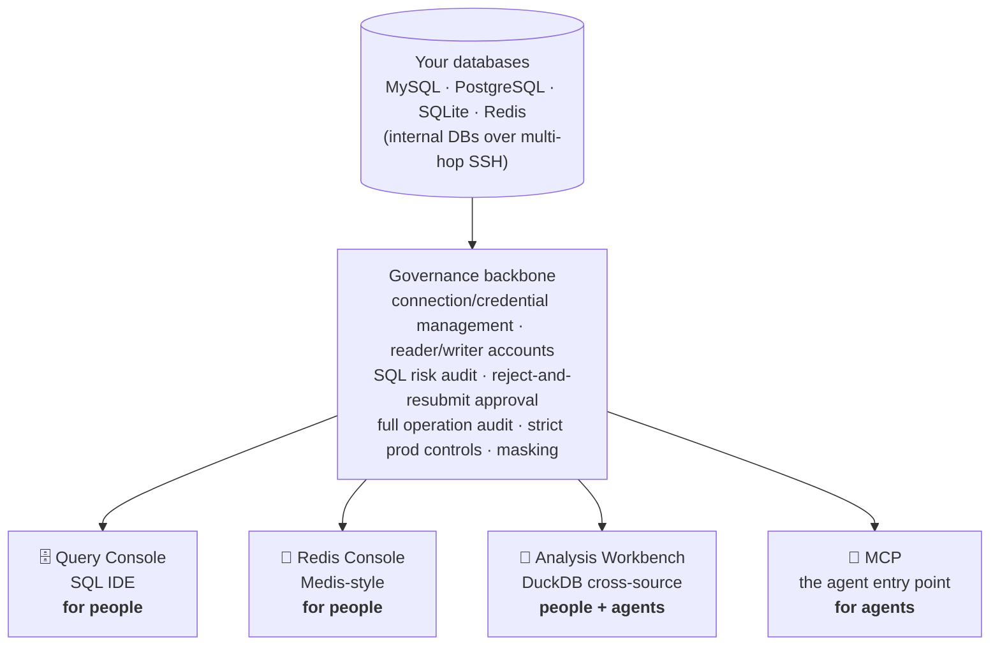

<div align="center">


# Quay

**A local database workbench. People query, agents fetch — one set of connections, one approval line.**

[](https://github.com/jianxinliu/Quay/actions/workflows/ci.yml)
[](LICENSE)
[](pyproject.toml)

**English** · [简体中文](README.md)


</div>

---

Your MySQL, PostgreSQL, SQLite, and Redis connections dock here (Quay = a wharf); internal
databases are reachable over multi-hop SSH. On top sit four frontends — a query console, a Redis
console, an analysis workbench, and MCP for agents — sharing one set of credentials, one risk
audit, and one operation log.

The point is that approval line. An agent's write is rejected first and turned into a change
request; it runs only after a human signs off — and what runs is the SQL stored in the request,
not whatever text got resubmitted (that's only fingerprint-checked). Reads pass through. Writes go
through a person.

> The brand is Quay, but the package is still `dbmcp` and the CLI is still `dbm` — the rename is
> cosmetic. MCP is just one of the entry points. This isn't "an MCP server"; it's a governed
> database workbench.

## Why use it

- **Hand an agent your database without fearing a dropped table.** Reads pass through; writes sit
  behind an approval flow; prod always needs a human.
- **One backend instead of several tools.** A DataGrip-style SQL IDE, a Medis-style Redis console,
  and DuckDB cross-source analysis — all on the same connections.
- **Local process, keys in the keyring.** Config files hold only `env://` / `keyring://` references.
  Passwords never land in plaintext, logs, or tool output.

## Quick start

```bash
uv sync --extra keyring
cp config/connections.example.yaml config/connections.yaml   # point it at your databases

DBM_ADMIN_TOKEN=some-long-random-string uv run dbm serve
```

Admin backend at <http://127.0.0.1:8100/admin>, MCP endpoint at `http://127.0.0.1:8100/mcp`.

Wire it into Claude Code:

```bash
claude mcp add --transport http dbm http://127.0.0.1:8100/mcp
```

For running as a service and one-click launch, see [Running it](#running-it).

## Four frontends, one governance backbone



## Query console

A dark, DataGrip-style SQL IDE — connect, browse, query, export, all on one screen.


- **Object tree**: database → table → columns/indexes/keys, table size graded in M/G/T; ⌘-select
  tables and batch DROP from the context menu (a red confirm bar stands in the way).
- **Editor**: Monaco core, context-aware completion (tables after `FROM`, columns after `alias.`,
  tables after `db.`), run only the statement under the cursor, EXPLAIN as a visual plan tree.
- **Table data**: double-click to open; WHERE / ORDER BY re-query through SQL and paginate without
  drifting rows; edit a cell, add/clone/delete rows — all through the write-confirm flow; CSV/paste
  import, ⌘F in-grid search, ⌘P jump to any table across databases.
- **Charts**: flip a result between table and chart — bar, line, pie, scatter — with X/Y and
  SUM/COUNT/AVG aggregation; the chart config is saved with the workflow and redrawn on re-run.
- **Nothing gets interrupted**: queries run async on the server, survive tab switches and reloads,
  and pick their results back up. Multiple tabs stay alive, result sets included.

A write pops a risk report first (which tables, how many rows, index hit or not, the plan). Only
after you confirm does the writer account run it, with an audit record. This is a backend bypass —
an agent's writes still go through the approval flow.

## Redis console

Key-value and relational models are too far apart to share a console without fighting each other,
so Redis gets its own page, built against Medis.

- Left column, database → key: all logical DBs listed, non-empty ones show a key count; keys form a
  tree by `:` prefix, folders drill down one branch at a time, types carry colored badges.
- Key detail renders by type with TTL / memory / encoding; msgpack values decode to JSON.
- Command window in Monaco, runs the cursor line; reads pass through, writes need confirmation;
  **a prod write asks you to retype the connection name**; passwords and hashes in `CONFIG GET` /
  `ACL` output are masked.
- A docs panel on the right follows the cursor, links to redis.io, covers 176 common commands.

## Analysis workbench

Snapshot data from different databases, tables, and local CSV/Parquet files into a local DuckDB
sandbox, then JOIN, aggregate, and build views freely. Cross-source analysis goes from "not
possible" to "one sentence" for an agent — the fetch runs through reader + audit + a row cap, the
computation stays in the sandbox, and only the small result comes back to the context.

You don't need to write SQL either: click "＋Flow" in the query console, drag nodes (fetch / filter
/ JOIN / aggregate / SQL / output) into a data-flow graph, run it, and watch each node get marked.
The graph is saved with the workflow so people and agents can re-run it. See **[ANALYSIS.md](ANALYSIS.md)**.

## How a write gets through

1. The agent calls `execute` with a write → risk is assessed, a change request is created, and the
   call is **rejected on the spot** with a `change_id`.
2. A person reviews the risk report at `/admin/approvals` and approves or rejects (or confirms
   in-session via elicitation, or from the CLI).
3. Once approved, the agent resubmits with `change_id` → the SQL stored in the request runs; the
   resubmitted text is only fingerprint-checked.
4. On rejection the reason goes back to the agent, which adjusts and tries again.

Three channels — in-session confirmation (on by default for local/dev), the admin backend, and the
CLI (`dbm approvals` / `approve` / `reject`). Every one of them leaves a record.

## Security model

- **Deny by default**: sqlglot parses the AST to classify; parse failures, multi-statement input,
  DML smuggled inside a CTE, `SELECT ... FOR UPDATE` — all treated as writes.
- **Two accounts**: everyday queries use a read-only reader; only approved executions switch to the writer.
- **A second line at the database**: MySQL `SESSION TRANSACTION READ ONLY`, PG
  `default_transaction_read_only`, SQLite `PRAGMA query_only`.
- **No plaintext secrets**: config holds only references; passwords stay out of logs and return
  values; credentials in Redis `CONFIG` / `ACL` output are masked.
- **Full audit**: every call, rejected ones included, records the agent, time, connection, SQL, row
  count, and duration.
- **Local-origin checks**: the backend validates `Host` / `Origin` to stop DNS rebinding and
  cross-site writes; connection and credential management is off-limits to agents — only people change it.

## MCP tools (for agents)

| Tool | What it does |
|---|---|
| `list_projects` / `list_connections` | Browse connections (no credentials; Redis intentionally hidden) |
| `query(project, connection, sql)` | Read-only SQL; non-reads rejected and audited; missing LIMIT injected |
| `execute(project, connection, sql, reason?, change_id?)` | Writes: first call makes a change request; resubmit with change_id after approval |
| `get_change_status(change_id)` | Change request status and risk report |
| `list_tables` / `describe_table` / `sample_rows` | Explore schema |
| `test_connection` | Connectivity check |
| `analysis_workspaces` / `analysis_import` / `analysis_sql` | DuckDB cross-source analysis (fetch audited and capped, sandbox free) |
| `save_workflow` / `run_workflow` | Persist an analysis and re-run it (script or DAG canvas) |

Query results go to agents as compact TSV, not JSON — cheaper in tokens; results have hard row and
character caps so they can't blow up the context.
> **Redis is not exposed to agents** — only people operate it, through the backend Redis console.

## Running it

```bash
# macOS launchd: start on login, auto-restart on crash (idempotent — re-run to hot-reload config)
bash scripts/install-launchd.sh
bash scripts/install-launchd.sh --uninstall
tail -f ~/Library/Logs/db-manage-mcp.log

# Build a double-clickable Quay.app (local build, no Gatekeeper prompt, icon bundled)
bash scripts/build-app.sh ~/Applications

# stdio mode (single-agent direct connection)
uv run dbm serve --stdio
```

Secrets live in `~/.config/db-manage-mcp/env` (mode 600). Rebuild the `.app` if you move the repo
(the path is baked in at build time).

## Docs

| Who you are | What to read |
|---|---|
| Using the backend | **[USER_GUIDE.md](USER_GUIDE.md)** (Chinese) — query console / Redis / analysis / approvals |
| An agent being integrated (or writing its prompts) | **[AGENT_GUIDE.md](AGENT_GUIDE.md)** (Chinese) — tool map, approval patterns, cross-source usage |
| Working on the code | **[DESIGN.md](DESIGN.md)** architecture & security · **[ANALYSIS.md](ANALYSIS.md)** analysis workbench · **[CONTRIBUTING.md](CONTRIBUTING.md)** |
| Found a vulnerability | **[SECURITY.md](SECURITY.md)** — don't open a public issue |

## Development

```bash
uv sync --extra keyring
uv run pytest          # full suite — must pass before you push
uv run ruff check .    # lint
```

Deployment is a **local process**, deliberately not Docker: on a single machine, reaching the host's
databases means routing around the network, there's no keyring backend in a container, and SSH key
paths change — all cost, no benefit.

## License

[Apache-2.0](LICENSE).
