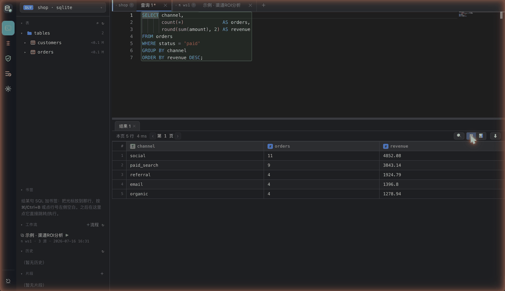
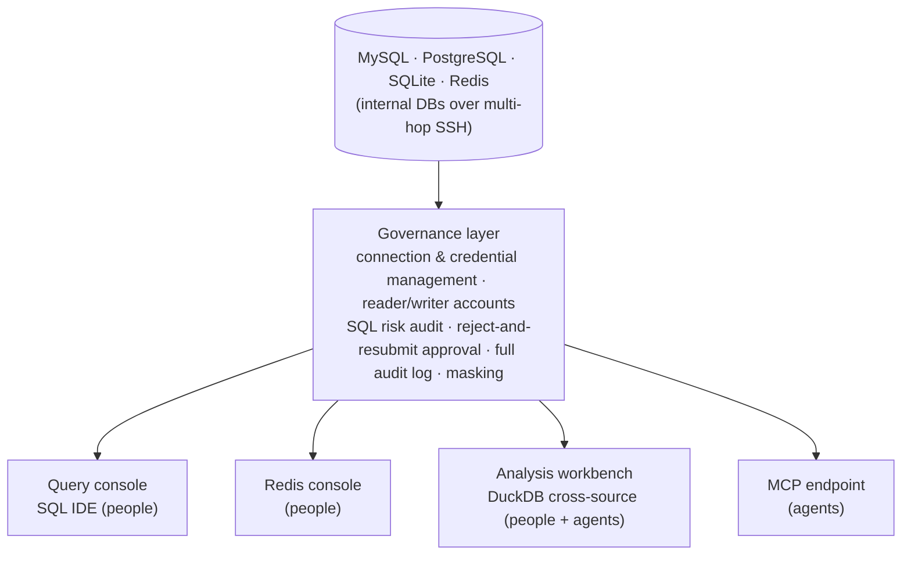
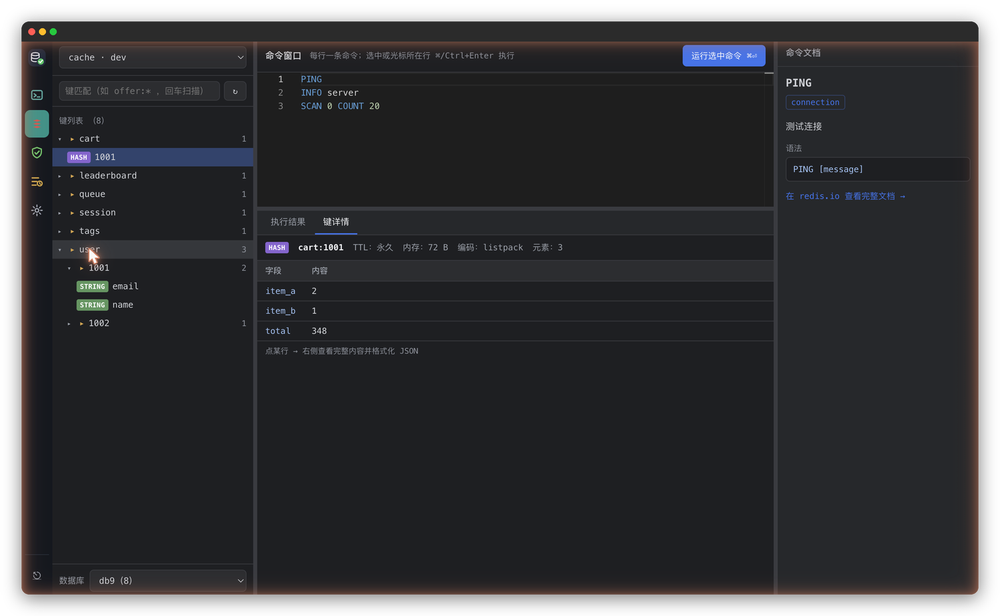
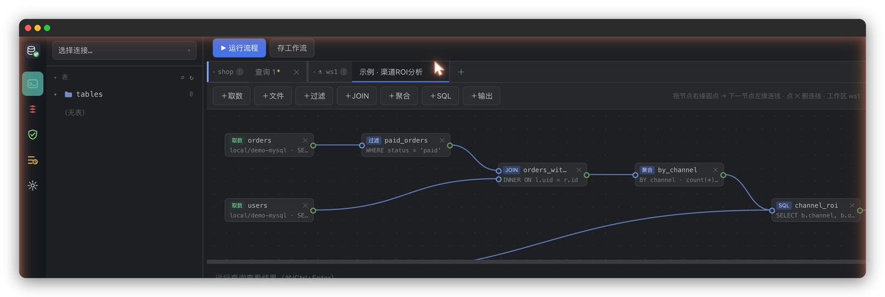

<div align="center">


# Quay

**A local database workbench shared by people and AI agents — agent writes require human approval**

[](https://github.com/jianxinliu/Quay/actions/workflows/ci.yml)
[](LICENSE)
[](pyproject.toml)

**English** · [简体中文](README.md)



</div>

---

When you connect a database to an AI agent, there are only two ways to grant access: read-only, which rules out much of what you need it for, or writable, which means reviewing every SQL statement it produces by hand. Quay exists to solve this.

It's a database workbench that runs on your own machine and manages connections to MySQL, PostgreSQL, SQLite, and Redis (internal databases are reachable over multi-hop SSH, with a separate key per hop if needed). It exposes four entry points: a SQL query console, a Redis console, and an analysis workbench for people, plus an MCP endpoint for agents. All of them share the same connection config, credential management, and audit log.

The constraint on agents is an approval flow. Read-only SQL runs immediately on a read-only account. A write is rejected on first submission, and a change request with a risk report is created instead. Once you review the report in the admin backend and approve it, the agent resubmits with the change ID and the statement runs — specifically, the SQL stored in the change request runs; the resubmitted text is only checked against its fingerprint and rejected on mismatch. Change requests expire after 60 minutes and are single-use — concurrent replays of the same request succeed exactly once. There is no path around approval for writes to production.

Passwords live in the system keyring. Config files hold only `env://` / `keyring://` references, and credentials never appear in logs or tool output.

> The name Quay means a wharf — the place your database connections converge. The Python package is `dbmcp`, the CLI is `dbm`, and the config directory is `~/.config/db-manage-mcp`.

## Quick start

```bash
uv sync --extra keyring
cp config/connections.example.yaml config/connections.yaml   # point it at your databases

DBM_ADMIN_TOKEN=some-long-random-string uv run dbm serve
```

The admin backend is at <http://127.0.0.1:8100/admin>, the MCP endpoint at `http://127.0.0.1:8100/mcp`.

To connect Claude Code:

```bash
claude mcp add --transport http dbm http://127.0.0.1:8100/mcp
```

For start-on-login and one-click launch, see [Running it](#running-it).

## How it's organized



## Query console

A DataGrip-style SQL IDE in the browser:


- The object tree on the left expands database → table → columns/indexes/keys, with table sizes next to the names. You can multi-select tables and batch-DROP them; a red confirmation bar precedes the delete.
- The editor is built on Monaco with context-aware completion: table names after `FROM`, columns after `alias.`, tables after `db.`. With multiple statements, only the one under the cursor runs. EXPLAIN output renders as a collapsible plan tree, with full table scans flagged in red.
- Double-click a table to browse its data. WHERE filters and column sorting regenerate the SQL query, so pagination stays consistent. Cells are editable in place — an edit produces a primary-key-scoped UPDATE that goes through the same write confirmation as everything else. There's also CSV/clipboard import, ⌘F in-grid search, and ⌘P to jump to any table across databases.
- Results export to CSV / JSON / Markdown / xlsx, or switch to bar, line, pie, and scatter charts with per-column SUM / COUNT / AVG aggregation. Chart config is saved with the workflow and redrawn on re-run.
- Queries run asynchronously on the server, so switching pages or reloading doesn't interrupt them; you come back and pick up the results. Tabs are preserved, result sets included. A running query can be cancelled — cancellation issues `KILL QUERY` / `pg_cancel_backend` against the database, actually terminating the statement rather than just dropping the client connection.

Running a write statement in the console first shows a risk report — which tables are affected, an estimated row count, whether an index is hit, the execution plan — and only after you confirm does the writer account execute it, with an audit record. This is a bypass for humans; agent writes still go through the approval flow. When connected to a production database, the whole console gets a red border, and production writes additionally require retyping the connection name.

<details>
<summary><b>Redis console</b> (expand for a screenshot)</summary>

<br>

Redis's key-value model differs enough from the relational model that a shared console would constrain both, so it gets its own page, with interactions modeled on Medis:



- Keys are organized into a tree by `:` prefix with colored type badges. The bar at the bottom switches logical databases; non-empty ones show a key count.
- Key detail renders by type, with TTL, memory usage, and encoding. msgpack-encoded values are decoded to JSON automatically.
- The command window runs the line under the cursor. Reads execute directly, writes require confirmation, and a write against production requires retyping the connection name. Passwords and password hashes in `CONFIG GET` / `ACL` output are masked.
- The docs panel on the right follows the cursor, covers 176 common commands, and links to redis.io.

</details>

<details>
<summary><b>Analysis workbench</b> — DuckDB cross-source analysis + a DAG canvas (expand for a screenshot)</summary>

<br>

The analysis workbench exists for cross-database queries: snapshot data from different databases, tables, and local CSV/Parquet files into a local DuckDB sandbox, then JOIN, aggregate, and build views freely. The fetch step uses the read-only account, is audited, and has a row cap (200k by default); once data is in the sandbox, it's local computation and needs no approval.

The same capability is available to agents (`analysis_import` / `analysis_sql`): for cross-database analysis, an agent pushes the computation down into the sandbox and brings only the summarized result back into its context — the raw data never passes through the conversation.



The query console also has a DAG canvas: drag nodes (fetch, filter, JOIN, aggregate, SQL, output) into a data-flow graph, run it, and watch each node report its status. A finished graph can be saved as a workflow that both people and agents can re-run. See **[ANALYSIS.md](ANALYSIS.md)**.

</details>

## AI assistant (optional)

The query console and the DAG canvas have an "✨ AI" entry point: describe what you want in plain language, and the AI generates SQL — or a whole workflow graph — from the table structures you select.

- **Generates only, never executes.** The output is inserted at the editor cursor (or onto the canvas) for you to review; it still goes through the existing write-confirmation / approval flow. The AI process is granted no tools — plain text in, plain text out, no access to the database.
- **Follow-ups.** After the first result you can keep refining ("group by week", "add a total"), continuing the same conversation without resending the schema; a follow-up SQL can replace the previous one or be appended. If a generated graph fails validation, the error is fed back and the AI repairs it once.
- **Three backends** (switch in system settings): `claude -p` / `codex exec` drive a local CLI; or **HTTP API** talks directly to an Anthropic / OpenAI-compatible endpoint, with the key stored in the system keyring — never in the database.
- SQL is auto-formatted with sqlglot; the explanation goes in as a comment above the statement. On by default; can be turned off in settings.

## How a write gets approved

1. The agent calls `execute` with a write statement. The server assesses the risk, creates a change request, rejects the call, and returns a `change_id` with the risk report.
2. A person reviews the risk report at `/admin/approvals` and approves or rejects it. Approval also works in-session via elicitation, or from the CLI (`dbm approvals` / `approve` / `reject`).
3. After approval the agent resubmits with the `change_id`, and the SQL stored in the change request runs. The resubmitted text is only fingerprint-checked and rejected on mismatch.
4. On rejection, the reason is returned to the agent so it can revise and resubmit.

Whichever of the three channels is used, the change request keeps a complete record. An unhandled change request expires after 60 minutes.

## Security model

- **Deny by default**: read-only classification is done by parsing the AST with sqlglot. Parse failures, multi-statement input, DML tucked inside a CTE, `SELECT ... FOR UPDATE` — all of it is treated as a write.
- **"Read-only" functions with side effects are treated as writes too**: `SLEEP`, `BENCHMARK`, `LOAD_FILE`, `pg_read_file`, `dblink`, and similar are blacklisted, so a read-only account can't be used for denial of service or for reading files off the server.
- **Two accounts**: everyday queries use a read-only reader account; only approved executions switch to the writer.
- **A second line at the database**: MySQL `SESSION TRANSACTION READ ONLY`, PostgreSQL `default_transaction_read_only`, SQLite `PRAGMA query_only` — even if classification gets it wrong, the read-only account can't write at the database level.
- **Default limits**: a SELECT without a LIMIT gets one injected (1000 rows by default), and statements time out after 30 seconds by default — both configurable per connection. A full-table SELECT can neither drag down the database nor exhaust client memory.
- **No plaintext secrets**: config holds references only; passwords stay out of logs and tool output, and credentials in Redis `CONFIG` / `ACL` output are masked.
- **Full audit**: every call, rejected ones included, records the agent identity, time, connection, SQL, row count, and duration.
- **Local-origin checks**: the admin backend validates `Host` / `Origin` against DNS rebinding and cross-site writes. Connection and credential management has no MCP tools at all — agents can't reach it; only people can change it, in the backend or via the CLI.

## MCP tools

| Tool | What it does |
|---|---|
| `list_projects` / `list_connections` | Browse available connections (no credentials; Redis connections are not listed) |
| `query(project, connection, sql)` | Read-only SQL; anything else is rejected and audited; a missing LIMIT is injected |
| `execute(project, connection, sql, reason?, change_id?)` | Writes: the first call creates a change request and returns a change_id; resubmit with it after approval |
| `get_change_status(change_id)` | Change request status and risk report |
| `list_tables` / `describe_table` / `sample_rows` | Explore schema |
| `test_connection` | Connectivity check |
| `analysis_workspaces` / `analysis_import` / `analysis_sql` | DuckDB cross-source analysis (fetches audited and row-capped, computation free in the sandbox) |
| `save_workflow` / `run_workflow` | Persist an analysis as a re-runnable workflow (script or DAG canvas) |

Query results going to agents get several specific treatments:

- Output is compact TSV rather than JSON, which measures out to roughly 25% fewer tokens.
- Results have two hard caps: rows (1000 by default) and characters (40000 by default, roughly 12k tokens). Past a cap, the result is truncated with a hint to narrow with WHERE or aggregation. The caps are enforced server-side — an agent cannot blow up its own context.
- Integers beyond JavaScript's safe range (2⁵³−1) are returned as strings, so snowflake IDs and the like keep their precision.

Redis is deliberately not exposed to agents — only people operate it, through the backend console.

## Running it

```bash
# macOS launchd: start on login + restart on crash (idempotent — re-run after config changes to hot-reload)
bash scripts/install-launchd.sh
bash scripts/install-launchd.sh --uninstall
tail -f ~/Library/Logs/db-manage-mcp.log

# Build a double-clickable Quay.app (local build, no Gatekeeper prompt, icon bundled)
bash scripts/build-app.sh ~/Applications

# stdio mode (single agent connects directly, no HTTP server)
uv run dbm serve --stdio
```

Environment-variable secrets go in `~/.config/db-manage-mcp/env` (mode 600). If you move the repo, rebuild the `.app` — the path is baked in at build time.

Deployment is a plain local process; Docker support was deliberately left out. On a single machine, a container has to route around the network to reach the host's databases, has no keyring backend, and needs SSH key paths remapped — for this use case it only adds cost.

## Docs

| Who you are | What to read |
|---|---|
| Using the backend | **[USER_GUIDE.md](USER_GUIDE.md)** (Chinese) — query console / Redis / analysis / approvals |
| An agent being integrated (or the person writing its prompts) | **[AGENT_GUIDE.md](AGENT_GUIDE.md)** (Chinese) — tool map, approval flow, cross-source analysis |
| Working on the code | **[DESIGN.md](DESIGN.md)** architecture & security · **[ANALYSIS.md](ANALYSIS.md)** analysis workbench · **[CONTRIBUTING.md](CONTRIBUTING.md)** |
| Found a vulnerability | **[SECURITY.md](SECURITY.md)** — please don't open a public issue |

## Development

```bash
uv sync --extra keyring
uv run pytest          # full test suite
uv run ruff check .    # lint
```

380+ tests. Beyond unit tests, the critical paths — the approval flow, multi-hop SSH (including per-hop keys), write timeouts — have real-environment e2e scripts (`scripts/e2e_*`), validated against actual MySQL 9.5, PostgreSQL 17, Redis 7, and real SSH tunnels.

The frontend has no build chain: Vue and Monaco are vendored into the repo, so it runs straight from a clone, and changing frontend code requires no Node.

## License

[Apache-2.0](LICENSE)
