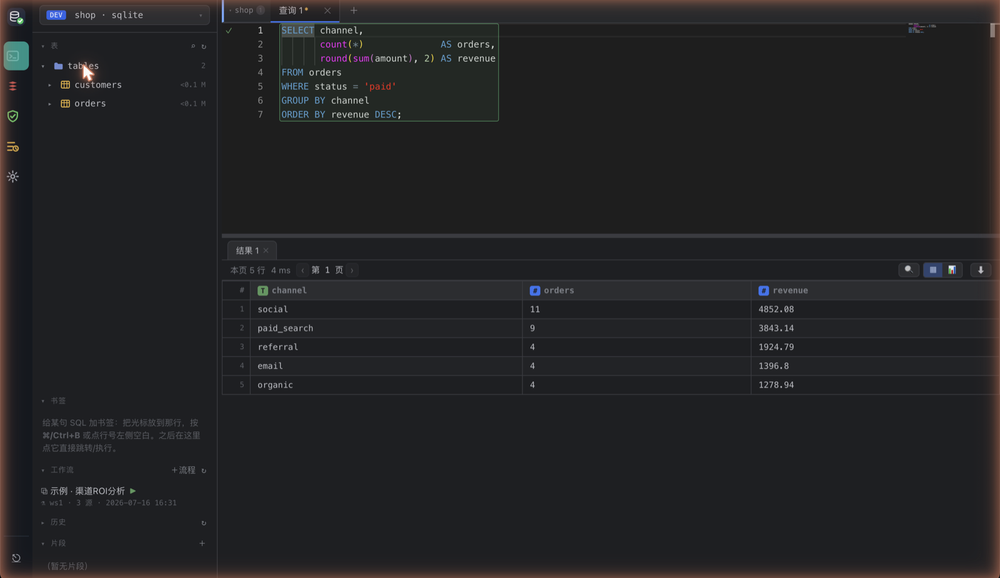
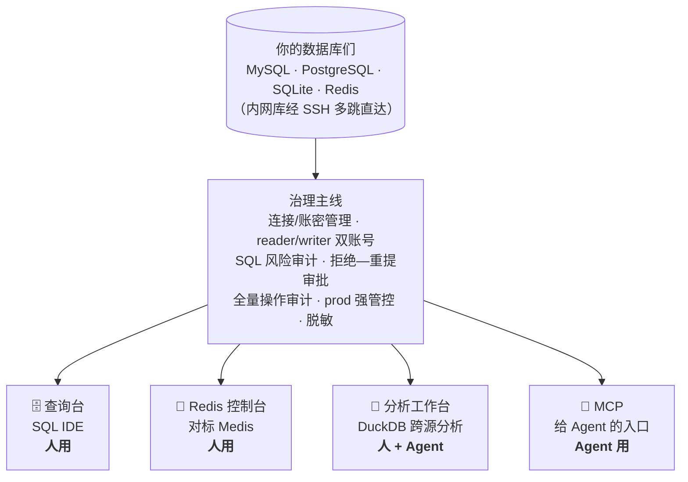
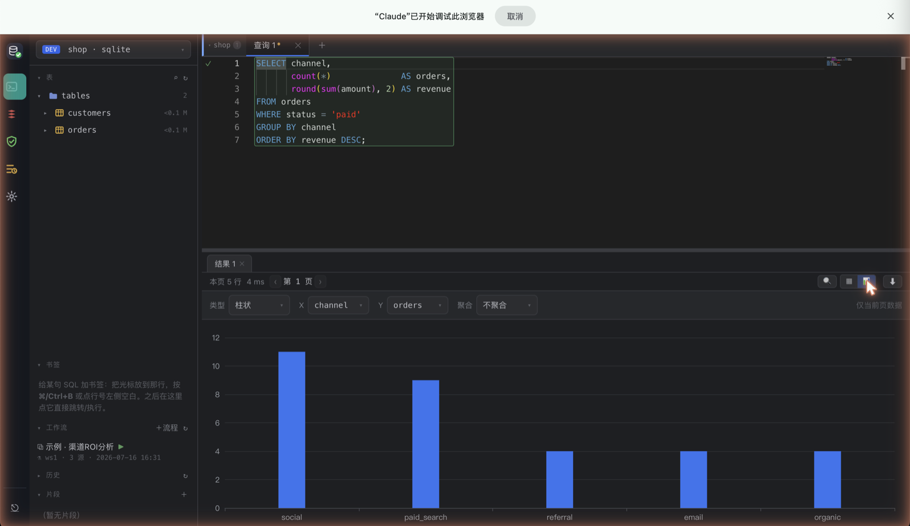

<div align="center">


# Quay

**本地数据库工作台。人查数、agent 取数，共用一套连接，一条审批线。**

[](https://github.com/jianxinliu/Quay/actions/workflows/ci.yml)
[](LICENSE)
[](pyproject.toml)

**简体中文** · [English](README.en.md)



</div>

---

MySQL、PostgreSQL、SQLite、Redis 的连接在这里“停靠”（Quay = 码头），内网库经 SSH 多跳直达。
上面挂四个前端——查询台、Redis 控制台、分析工作台，和给 agent 的 MCP——共用同一套账密管理、
风险审计、操作留痕。

关键是那条审批线。agent 的写操作先被拒、生成审批单，人点头了才放行；真正执行的永远是审批单里
存的那条 SQL，重提的文本只拿去比对指纹。只读直接走，写得过人这一关。

> 品牌叫 Quay，包名还是 `dbmcp`、命令还是 `dbm`——改名只对外，技术标识没动。
> MCP 只是入口之一。这不是“一个 MCP server”，是一个带治理的数据库工作台。

## 为什么用它

- **把库交给 agent，又不怕它删库。** 只读直通，写操作卡在审批流后面，prod 环境强制人工放行。
- **一个后台顶几个工具。** DataGrip 式 SQL IDE、Medis 式 Redis 控制台、DuckDB 跨源分析，同一套连接跑到底。
- **本地进程，密钥进 keyring。** 配置文件只存 `env://` / `keyring://` 引用，密码不落明文、不进日志、不进返回值。

## 快速开始

```bash
uv sync --extra keyring
cp config/connections.example.yaml config/connections.yaml   # 改成你的库

DBM_ADMIN_TOKEN=随便一串足够长的字符 uv run dbm serve
```

后台在 <http://127.0.0.1:8100/admin>，MCP 端点在 `http://127.0.0.1:8100/mcp`。

给 Claude Code 挂上：

```bash
claude mcp add --transport http dbm http://127.0.0.1:8100/mcp
```

常驻、开机自启、双击启动见下面的 [常驻与启动](#常驻与启动)。

## 四个前端，一条治理主线



## 查询台

DataGrip 式的深色 SQL IDE，连库、看表、查数、导出一屏搞定。



- **对象树**：库 → 表 → 列/索引/键，表容量按 M/G/T 分级；⌘ 多选表右键批量 DROP（红色确认条挡一道）。
- **编辑器**：Monaco 内核，补全认上下文（`FROM` 后补表、`别名.` 补列、`库.` 补表），多语句只跑光标那条，EXPLAIN 出可视化计划树。
- **表数据**：双击打开，WHERE / ORDER BY 走 SQL 重查、翻页不错行；双击单元格改值、行级增删克隆，都走写确认；CSV / 粘贴导入、⌘F 网格内搜、⌘P 跨库找表。
- **结果画图**：一键切「表格 / 图表」，柱、折线、饼、散点，配 X/Y 和 SUM/COUNT/AVG 聚合；图表配置随 workflow 存，重跑自动出图。
- **不打断**：查询在服务端异步跑，切页刷新都不中断，回来接着取结果。多 tab 连结果集一起保活。

写语句先弹风险报告（影响哪些表、多少行、命中索引没、执行计划），确认了才由 writer 账号执行并审计。
这是后台旁路——agent 的写操作照样得走审批流。

## Redis 控制台

键值和关系两套模型差太远，硬塞进查询台只会互相拖累，所以单开一页，对着 Medis 做。

- 左栏库 → 键：库列全、有数据的标键数；键按 `:` 前缀成树，点文件夹一路钻到底，类型带彩色徽章。
- 键详情按类型展开，带 TTL / 内存 / 编码；msgpack 值自动解成 JSON。
- 命令窗口 Monaco，光标行执行；读直通、写要确认；**prod 写命令得再输一遍连接名**；`CONFIG GET` / `ACL` 结果里的密码口令自动打码。
- 右侧命令文档随光标切，链到 redis.io，覆盖 176 条常用命令。

## 分析工作台

把不同库、不同表、本地 CSV/Parquet 的数据快照进本地 DuckDB 沙箱，随便 JOIN、聚合、建视图。
跨源分析对 agent 从“做不到”变成“一句话”——取数走 reader + 审计 + 行数上限，算在沙箱里，只把小结果带回上下文。

不会写 SQL 也能搭：查询台点「＋流程」，拖节点（取数 / 过滤 / JOIN / 聚合 / SQL / 输出）连成数据流图，
一键跑、逐节点标状态，图随 workflow 存，人和 agent 都能重跑。详见 **[ANALYSIS.md](ANALYSIS.md)**。

## 写操作怎么放行

1. agent 调 `execute` 提交写 SQL → 评估风险、生成审批单，**当场拒绝**并返回 `change_id`。
2. 人在 `/admin/approvals` 看完风险报告批准或拒绝（也可以会话内 elicitation 确认，或用 CLI）。
3. 批准后 agent 带 `change_id` 重提 → 执行审批单里存的那条 SQL，重提文本只做指纹校验。
4. 被拒就把理由带回给 agent，改完再来。

三条通道——会话内确认（local/dev 默认开）、管理后台、CLI（`dbm approvals` / `approve` / `reject`）——
无论走哪条，审批单都留痕。

## 安全模型

- **默认拒绝**：sqlglot 解析 AST 分类，解析失败、多语句、CTE 夹带 DML、`SELECT ... FOR UPDATE` 这些一律按写处理。
- **双账号**：日常查询走只读 reader，只有审批通过的执行才切 writer。
- **数据库层再兜一道**：MySQL `SESSION TRANSACTION READ ONLY`、PG `default_transaction_read_only`、SQLite `PRAGMA query_only`。
- **密钥不落明文**：配置只存引用，密码不进日志和返回值；Redis `CONFIG` / `ACL` 结果里的凭证自动脱敏。
- **全量审计**：每次调用（含被拒的）都记 agent、时间、连接、SQL、行数、耗时。
- **本机来源校验**：后台校验 `Host` / `Origin`，挡 DNS rebinding 和跨站写；连接与密钥管理不给 agent 碰，只有人能改。

## MCP 工具（给 Agent）

| 工具 | 说明 |
|---|---|
| `list_projects` / `list_connections` | 浏览可用连接（不含账密；Redis 有意不出现） |
| `query(project, connection, sql)` | 只读 SQL；非只读一律拒绝并审计；缺 LIMIT 自动注入兜底 |
| `execute(project, connection, sql, reason?, change_id?)` | 写操作：首提生成审批单返回 change_id，批准后带它重提才执行 |
| `get_change_status(change_id)` | 查审批单状态与风险报告 |
| `list_tables` / `describe_table` / `sample_rows` | 探 schema |
| `test_connection` | 连通性检查 |
| `analysis_workspaces` / `analysis_import` / `analysis_sql` | DuckDB 跨源分析（取数受审计限流，沙箱内自由算） |
| `save_workflow` / `run_workflow` | 沉淀分析脚本、一键重跑（脚本式或 DAG 画布） |

给 agent 的查询结果是紧凑 TSV，不是 JSON——省 token；结果有行数和字符两级硬上限，防拉爆上下文。
> **Redis 不给 agent** —— 只有人能通过后台 Redis 控制台操作。

## 常驻与启动

```bash
# macOS launchd：开机自启 + 崩溃自动拉起（幂等，改配置重跑即热重启）
bash scripts/install-launchd.sh
bash scripts/install-launchd.sh --uninstall
tail -f ~/Library/Logs/db-manage-mcp.log

# 生成可双击的 Quay.app（本地构建不触发 Gatekeeper，图标已内置）
bash scripts/build-app.sh ~/Applications

# stdio 模式（单 agent 直连）
uv run dbm serve --stdio
```

密钥写在 `~/.config/db-manage-mcp/env`（600 权限）。仓库整体搬家后 `.app` 要重建（路径构建时写死）。

## 文档

| 你是谁 | 看哪份 |
|---|---|
| 用后台的人 | **[USER_GUIDE.md](USER_GUIDE.md)** — 查询台 / Redis / 分析 / 审批操作手册 |
| 接入的 agent（或写 agent 提示词的人） | **[AGENT_GUIDE.md](AGENT_GUIDE.md)** — 工具地图、审批套路、跨源分析用法 |
| 想改代码的人 | **[DESIGN.md](DESIGN.md)** 架构与安全 · **[ANALYSIS.md](ANALYSIS.md)** 分析工作台 · **[CONTRIBUTING.md](CONTRIBUTING.md)** 开发约定 |
| 发现漏洞 | **[SECURITY.md](SECURITY.md)** —— 别开公开 issue |

## 开发

```bash
uv sync --extra keyring
uv run pytest          # 全量测试，改完必须全过
uv run ruff check .    # lint
```

部署是**本地进程模式**，有意不上 Docker：本地单机连宿主库要绕网络、容器里没 keyring 后端、
SSH key 路径还得改，纯添麻烦。

## License

[Apache-2.0](LICENSE)。
