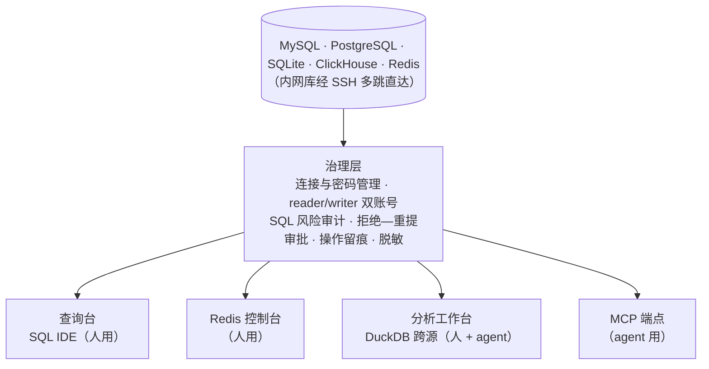

<div align="center">


# Quay

**人和 AI agent 共用的本地数据库工作台，agent 的写操作必须经人审批**

[](LICENSE)
[](pyproject.toml)

**简体中文** · [English](README.en.md)


</div>

---

把数据库接给 AI agent，权限只有两种给法：只读，很多事它做不了；可写，它发出的每一条 SQL 你都得人工审查。Quay 用来解决这个问题。

它是一个跑在本机的数据库工作台，统一管理 MySQL / PostgreSQL / SQLite / ClickHouse / Redis 的连接（内网库走 SSH 多级跳板直连，每跳可配独立密钥），对外有四个入口：给人用的 SQL 查询台、Redis 控制台、分析工作台，和给 agent 用的 MCP 端点。所有入口共用同一套连接配置、密码管理和操作审计。

对 agent 的核心约束是一条审批流。只读 SQL 用只读账号直接执行；写操作第一次提交会生成一张带风险报告的审批单，当次调用就地等人批准（默认 120 秒）。你点开会话里的链接看过报告、点了批准，这次调用就会自动执行审批单里存的那条 SQL——不必回到对话里说「已批准」，也不必 agent 再重提一次。超时后审批单仍有效，agent 用 `wait_for_change` 续等。审批单 60 分钟过期、一次性核销（并发重放同一张单只会成功一次），生产环境的写操作没有绕过审批的途径。

密码存在系统 keyring 里，配置文件只保留 `env://` / `keyring://` 引用，不会出现在日志和工具返回值中。

> 名字 Quay 意为码头，取数据库连接汇聚于此之意。Python 包名是 `dbmcp`，命令行是 `dbm`，配置目录是 `~/.config/db-manage-mcp`。

## 快速开始

```bash
uv sync --extra keyring
cp config/connections.example.yaml config/connections.yaml   # 改成你的库

DBM_ADMIN_TOKEN=一串足够长的随机字符 uv run dbm serve
```

管理后台在 <http://127.0.0.1:8100/admin>，MCP 端点在 `http://127.0.0.1:8100/mcp`。

接入任意 MCP 客户端（Claude Code / Codex / Cursor / DeepSeek Harness 等）见 [接入 Agent](#接入-agent)。用法见 **[AGENT_GUIDE.md](AGENT_GUIDE.md)**。

开机自启、双击启动等见 [常驻与启动](#常驻与启动)。

## 接入 Agent

Quay 是 MCP 服务：传输是 **streamable HTTP**（常驻进程，推荐），也兼容 **stdio**（单 agent 直连）。推荐所有客户端都接到已经在跑的 `http://127.0.0.1:8100/mcp`——查询台、审批、审计、多个 agent 共用这一份进程。不要给每个 agent 再起一份 `dbm serve`：stdio 会再拉一个独立进程，审批单和后台对不上。

工具怎么用见 **[AGENT_GUIDE.md](AGENT_GUIDE.md)**（可直接放进 agent 系统提示）。下面只讲各家客户端怎么接到这个端点。

**工具调用超时**：写操作默认在服务端等审批 120 秒。客户端默认超时更短时（Codex / DeepSeek Harness 都是 60 秒），把客户端超时调到 **≥ 180 秒**，否则人还没点批准，客户端已经把这次调用掐掉。也可以把系统设置里的「审批等待时长」调短，超时后 agent 调 `wait_for_change` 续等，单不会丢。

本机若开了 SOCKS / HTTP 代理，部分客户端会把 `127.0.0.1` 也送进代理得到 502。给客户端加上 `NO_PROXY=127.0.0.1,localhost`（或等价配置）。

### Claude Code

推荐接到 user scope，所有项目都能用这份本地工作台：

```bash
claude mcp add --transport http --scope user dbm http://127.0.0.1:8100/mcp
```

等价配置（`~/.claude.json` 顶层 `mcpServers`，或项目根 `.mcp.json`）：

```json
{
  "mcpServers": {
    "dbm": {
      "type": "http",
      "url": "http://127.0.0.1:8100/mcp"
    }
  }
}
```

`claude mcp list` 能看到 `dbm` 即成功。只在某个仓库用时去掉 `--scope user`（默认 local）。

### Codex

Codex 的配置是 **TOML**（不是 JSON）。全局文件 `~/.codex/config.toml`：

```toml
[mcp_servers.dbm]
url = "http://127.0.0.1:8100/mcp"
startup_timeout_sec = 15
tool_timeout_sec = 180
```

或让 CLI 写 URL，超时仍建议手改：

```bash
codex mcp add dbm --url http://127.0.0.1:8100/mcp
```

`codex mcp list` 确认已连接。ChatGPT 桌面端 / Codex IDE 扩展与 CLI 共用这份配置。

### Cursor

全局（所有仓库）：`~/.cursor/mcp.json`。也可以 Cursor Settings → MCP 里加点。

```json
{
  "mcpServers": {
    "dbm": {
      "type": "http",
      "url": "http://127.0.0.1:8100/mcp"
    }
  }
}
```

`type` 用 `"http"`，不要写成 `"streamable-http"`：Cursor 编辑器能认后者，但 `cursor-agent` CLI 会把整份 `mcp.json` 静默丢掉。项目级写在 `.cursor/mcp.json`。改完后 MCP 面板里 `dbm` 应为绿灯。

### DeepSeek Harness

在 `cordis.yml` 里加一个 `@deepseek-ai/dsh-mcp-client` 实例（一个 MCP 服务对应一条）。工具会出现成 `mcp__dbm__query`、`mcp__dbm__execute` 这种带前缀的名字，用法不变。

```yaml
- id: mcp-dbm
  name: '@deepseek-ai/dsh-mcp-client'
  config:
    serverName: dbm
    transport: streamable-http
    url: http://127.0.0.1:8100/mcp
    toolCallTimeoutMs: 180000
    failOnStartupError: true
```

`serverName` 在当前 harness 里必须唯一。改配置后插件会断线重连，不必重启整个进程。

### 其他常见客户端

| 客户端 | 配置位置 | 片段 |
|---|---|---|
| **Claude Desktop** | Settings → Connectors → Add custom connector（URL 填下面这一行）。不要把 `url` 写进 `claude_desktop_config.json`，桌面版会整段抹掉 `mcpServers`。 | `http://127.0.0.1:8100/mcp` |
| **VS Code / GitHub Copilot** | `.vscode/mcp.json`（注意顶层键是 `servers`，不是 `mcpServers`） | `{ "servers": { "dbm": { "type": "http", "url": "http://127.0.0.1:8100/mcp" } } }` |
| **Gemini CLI** | `gemini mcp add --transport http dbm http://127.0.0.1:8100/mcp`；或 `~/.gemini/settings.json` 的 `mcpServers` | `"dbm": { "httpUrl": "http://127.0.0.1:8100/mcp" }`（`httpUrl` = streamable HTTP；不要把同一 URL 写到 `url` 上，那是旧的 SSE） |
| **Windsurf** | `~/.codeium/windsurf/mcp_config.json` | `{ "mcpServers": { "dbm": { "serverUrl": "http://127.0.0.1:8100/mcp" } } }` |
| **任意只支持 stdio 的客户端** | 仅当本机**没有**常驻 HTTP 实例时用 | `command`: `uv`，`args`: `["run", "--directory", "/绝对路径/Quay", "dbm", "serve", "--stdio"]` |

协议层面：实现了 MCP 的 streamable HTTP 即可。URL 是 `http://127.0.0.1:8100/mcp`，本机回环、无鉴权——不要把 8100 暴露到局域网或公网。

## 整体结构


```mermaid
flowchart TB
    DB[("MySQL · PostgreSQL · SQLite · ClickHouse · Redis<br/>（内网库经 SSH 多跳直达）")]
    DB --> GOV["治理层<br/>连接与密码管理 · reader/writer 双账号<br/>SQL 风险审计 · 拒绝—重提审批 · 操作留痕 · 脱敏"]
    GOV --> T1["查询台<br/>SQL IDE（人用）"]
    GOV --> T2["Redis 控制台<br/>（人用）"]
    GOV --> T3["分析工作台<br/>DuckDB 跨源（人 + agent）"]
    GOV --> T4["MCP 端点<br/>（agent 用）"]
```

## 查询台

浏览器里的 DataGrip 风格 SQL IDE：


- 左侧对象树按 库 → 表 → 列/索引/键 展开，表名旁标容量；可以多选表批量 DROP，删除前有红色确认条。
- 编辑器基于 Monaco，补全带上下文：`FROM` 后面补表名，`别名.` 补列名，`库.` 补该库的表。多条语句只执行光标所在那条；EXPLAIN 结果渲染成可折叠的计划树，全表扫描会标红提示。
- 双击表名直接看数据。WHERE 过滤和列头排序都会重新生成 SQL 查询，翻页不会错行；单元格可以直接编辑，改动生成按主键定位的 UPDATE，和其他写操作一样要先确认。另有 CSV / 剪贴板导入、⌘F 网格内搜索、⌘P 跨库找表。
- 结果可导出 CSV / JSON / Markdown / xlsx，也可以切成柱状图、折线图、饼图、散点图，支持按列做 SUM / COUNT / AVG 聚合；图表配置随 workflow 保存，重跑自动出图。
- 查询在服务端异步执行，切走页面或刷新都不中断，回来接着看结果；多个 tab 连同结果集一起保留。运行中的查询可以取消——取消会对数据库发 `KILL QUERY` / `pg_cancel_backend`，真正终止语句，而不是只断开客户端。

在查询台里执行写语句会先弹出风险报告——影响哪些表、预估多少行、是否命中索引、执行计划——确认后才用 writer 账号执行并记审计。这是给人开的旁路，agent 的写操作仍然要走审批流。连接生产库时整个界面套红色边框。ClickHouse 本期只做只读分析，连接上没有 writer。

<details>
<summary><b>Redis 控制台</b>（点开看截图）</summary>

<br>

Redis 的键值模型和 SQL 的关系模型差别很大，共用一个界面会让两边的交互都受限，所以单独做了一页，交互参考 Medis：


- 键按 `:` 前缀组织成树，带类型彩色徽章；底部可切换逻辑库，有数据的库标出键数。
- 键详情按类型展示，附 TTL、内存占用、编码方式；msgpack 编码的值自动解成 JSON。
- 命令窗口执行光标所在行：读命令直接执行，写命令需要确认；生产环境的写命令还要再输入连接名才放行。`CONFIG GET` / `ACL` 输出里的密码和口令哈希会被遮蔽。
- 右侧文档面板跟着光标切换，覆盖 176 条常用命令，链接到 redis.io。

</details>

<details>
<summary><b>分析工作台</b>——DuckDB 跨源分析 + DAG 画布（点开看截图）</summary>

<br>

分析工作台解决跨库查询的问题：把不同数据库、不同表、本地 CSV / Parquet 文件的数据快照进一个本地 DuckDB 沙箱，在沙箱里随意 JOIN、聚合、建视图。取数阶段走只读账号、记审计、有行数上限（默认 20 万行）；进了沙箱之后就是本地计算，不需要审批。

这套能力同样开放给 agent（`analysis_import` / `analysis_sql`）：跨库分析时把计算下推到沙箱执行，只把汇总后的小结果带回上下文，原始数据不经过对话。


查询台和独立流程页都可以编排 DAG：拖节点（取数、过滤、JOIN、聚合、统计、SQL、输出）连成数据流图，一键执行、逐节点显示状态。搭好的图可以存成 workflow，人和 agent 都能重跑，也可以设成定时任务。详见 **[ANALYSIS.md](ANALYSIS.md)**。

</details>

## AI 助手（可选）

查询台和 DAG 画布上有一个「✨ AI」入口：用自然语言描述你想查什么，AI 按你选的表结构生成 SQL 或整张 workflow 流程图。

- **只生成、不执行**：产物只回填到编辑器光标处（或画布），仍然要你审阅、并走既有的写确认 / 审批闭环。AI 进程不被授予任何工具，纯文本进出，碰不到数据库。
- **能追问**：生成后可以继续说「改成按周分组」「再加金额合计」，续接同一会话，不用重发表结构；SQL 结果可选替换上一条或追加。生成的流程图若校验不过，会把错误回喂给 AI 自动修一次。
- **三种后端可选**（系统设置里切换）：`claude -p` / `codex exec` 调本机命令行 AI；或 **HTTP API** 直连 Anthropic / OpenAI 兼容端点，密钥存进系统钥匙串（keyring），绝不落库。
- SQL 会用 sqlglot 自动格式化，解释以注释写在语句上方。默认开启，可在系统设置关闭。

## 写操作的审批流程

1. agent 调 `execute` 提交写 SQL。服务端评估风险、生成审批单，**当次调用就地等待**（默认 120 秒），并把 `approval_url` 回给 agent。
2. 人点开会话里的链接（或 `/admin/approvals`）看风险报告，批准或拒绝。也可以在会话内 elicitation，或用 CLI（`dbm approvals` / `approve` / `reject`）。后台有「批准并立即执行」：人点一次当场落地。
3. 等待中的调用在批准后**自动执行审批单里存的 SQL**，返回 `status=executed`。不必让用户回到对话里说「已批准」，也不必 agent 再重提一次。重提文本只做指纹校验，不一致即拒绝。
4. 等待超时返回 `approval_required`：审批单仍有效（60 分钟），agent 调 `wait_for_change` 续等。被拒绝时理由回给 agent，供其改完再提交。

新审批单会进管理后台右上角铃铛，也可以在系统设置里打开 Bark / 企微 / 飞书。不主动推送成功——只在需要人点批准时通知。

三条审批通道走哪条都会在审批单上留下完整记录。审批单 60 分钟未处理自动过期。

## 安全模型

- **默认拒绝**：用 sqlglot 解析 AST 做只读判定。解析失败、多语句、CTE 里夹带的 DML、`SELECT ... FOR UPDATE`，一律按写操作处理。
- **有副作用的「只读」函数也按写处理**：`SLEEP` / `BENCHMARK` / `LOAD_FILE` / `pg_read_file` / `dblink` 等在黑名单上——防止只读账号被用来做拒绝服务或读服务器文件。
- **双账号**：日常查询用只读的 reader 账号，只有审批通过的执行才切换到 writer。
- **数据库层再设一道**：MySQL `SESSION TRANSACTION READ ONLY`、PostgreSQL `default_transaction_read_only`、SQLite `PRAGMA query_only`、ClickHouse URL `readonly=1`，即使分类出错，只读账号在数据库层面也写不进去。
- **默认限流**：缺 LIMIT 的 SELECT 自动注入 LIMIT（默认 1000 行），语句超时默认 30 秒，都可按连接配置——一条全表 SELECT 拖不垮数据库，也拉不爆客户端内存。
- **密钥不落明文**：配置只存引用，密码不进日志、不进工具返回值；Redis `CONFIG` / `ACL` 输出里的凭证自动脱敏。
- **全量审计**：每次调用（包括被拒绝的）都记录 agent 身份、时间、连接、SQL、行数和耗时。
- **本机来源校验**：管理后台校验 `Host` / `Origin`，防 DNS rebinding 和跨站写请求。连接和密钥管理没有对应的 MCP 工具，agent 碰不到，只能由人在后台或 CLI 修改。

## MCP 工具

| 工具 | 说明 |
|---|---|
| `begin_session(title, note?)` | 声明本次会话名字/背景；之后本会话的 SQL 在审计页按会话归类 |
| `list_projects` / `list_connections` | 浏览可用连接（不含账密；Redis 连接不出现在列表里） |
| `list_databases` | 列库 / schema（连接未绑默认库时先调这个） |
| `query(project, connection, sql)` | 只读 SQL；非只读一律拒绝并审计；缺 LIMIT 自动注入 |
| `export_table(...)` | 按表导出 CSV / JSON / Markdown / xlsx，返回短期下载链接（正文不进上下文） |
| `execute(project, connection, sql, reason?, change_id?, wait_seconds?)` | 写操作：生成审批单并等待批准，批准即自动执行 |
| `wait_for_change(change_id)` / `get_change_status(change_id)` | 超时后续等 / 立即查审批单状态 |
| `sync_table(...)` | 把表从一个库同步到另一个库（典型：线上 → 本地）：结构 + 按条件取的少量数据。目标是 local/dev 连接直接执行（仍审计），staging 才走 execute 那套审批；目标不能是 prod |
| `list_tables` / `describe_table` / `sample_rows` | 探索 schema |
| `test_connection` | 连通性检查 |
| `analysis_workspaces` / `analysis_import` / `analysis_sql` | DuckDB 跨源分析（取数受审计和行数上限约束，沙箱内自由计算） |
| `save_workflow` / `run_workflow` | 把分析沉淀成可重跑的流程（脚本或 DAG 画布） |

给 agent 的查询结果做了几项针对性处理：

- 输出用紧凑的 TSV 格式而不是 JSON，实测省 25% 左右的 token。
- 结果有两级硬上限：行数（默认 1000）和字符数（默认 40000，约 12k token），超限截断并提示用 WHERE / 聚合收窄——上限在服务端强制，agent 无法拉爆自己的上下文。
- 超出 JavaScript 安全整数范围（2⁵³−1）的大整数以字符串返回，雪花 ID 之类的值不丢精度。

Redis 有意不暴露给 agent，只能由人在后台操作。

## 常驻与启动

```bash
# macOS launchd：开机自启 + 崩溃自动拉起（幂等，改完配置重跑即热重启）
bash scripts/install-launchd.sh
bash scripts/install-launchd.sh --uninstall
tail -f ~/Library/Logs/db-manage-mcp.log

# 生成可双击的 Quay.app（本地构建，不触发 Gatekeeper，图标已内置）
bash scripts/build-app.sh ~/Applications

# stdio 模式（单 agent 直连，不起 HTTP 服务）。常驻实例已经在 8100 时不要用这个——改接 HTTP，见 [接入 Agent](#接入-agent)
uv run dbm serve --stdio
```

环境变量形式的密钥写在 `~/.config/db-manage-mcp/env`（600 权限）。仓库整体搬家后 `.app` 需要重建，路径是构建时写死的。

部署形态是本地进程，有意没做 Docker：单机场景下容器连宿主机的库要绕网络、容器里没有 keyring 后端、SSH key 还要改挂载路径，对这个场景只增加成本。

## 文档

| 你是谁 | 看哪份 |
|---|---|
| 用后台的人 | **[USER_GUIDE.md](USER_GUIDE.md)** —— 查询台 / Redis / 分析 / 审批操作手册 |
| 接入的 agent（或写 agent 提示词的人） | 本文 [接入 Agent](#接入-agent)（Claude Code / Codex / Cursor / DeepSeek Harness 等）· **[AGENT_GUIDE.md](AGENT_GUIDE.md)** 工具地图与审批套路 |
| 想改代码的人 | **[DESIGN.md](DESIGN.md)** 架构与安全设计 · **[ANALYSIS.md](ANALYSIS.md)** 分析工作台 · **[CONTRIBUTING.md](CONTRIBUTING.md)** 开发约定 |
| 发现安全漏洞 | **[SECURITY.md](SECURITY.md)** —— 请勿开公开 issue |

## 开发

```bash
uv sync --extra keyring
uv run pytest          # 全量测试
uv run ruff check .    # lint
```

700+ 个测试；审批流、SSH 多跳（含每跳独立密钥）、写超时、ClickHouse 只读等关键路径除单测外都有真实环境 e2e 脚本（`scripts/e2e_*`），对真实的 MySQL 9.5 / PostgreSQL 17 / Redis 7 / ClickHouse 24 和真实 SSH 隧道验证过。

前端没有构建链：Vue 和 Monaco 直接 vendor 进仓库，clone 下来就能跑，改前端代码不需要 Node。

## License

[Apache-2.0](LICENSE)
